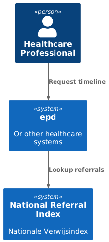

# Interface Specification National Referral Index - Lookup


## Disclaimer

The GFModules project is currently under development. The information in this interface description is
subject to change.


## Context

The GFModules project is a collection of applications that have the purpose to improve the
data exchange between healthcare providers. The project is the technical implementation of
the various components of the 'Generieke Functies, lokalisatie en addressering' project of the
Ministry of Health, Welfare and Sport of the Dutch government.

The National Referral Index (NRI) is responsible for the referral of the Health Data. The NRI contains a referral
to the register that associates a Health Provider with pseudonym and data domain.

This interface description and other interfaces of this application can be found at the [github repository](https://github.com/minvws/gfmodules-national-referral-index/tree/feat/interface-description/docs/interface-definitions).

<div style="page-break-after: always;"></div>


## Process

This interface is used in the Generic Function Localisation. In this interface is described how a healthcare party 
can request the localisation information for a pseudonymised BSN.




## Authentication

All endpoints that are described here are only accessible behind mTLS with a valid UZI Server Certificate.


## Endpoints

The following endpoints are provided:

- [info](#info)


<div style="page-break-after: always;"></div>

### Info

The info endpoint gets information about the referrals by pseudonym and data domain.


|  |  |
|---|---|
| Path | /info |
| Type | POST |
| Query Parameters | None |
| JSON payload | [Pseudonym](#pseudonym), [DataDomain](#datadomain) |


Example CURL request:

```curl
curl -X 'POST' \
  'https://referral-index/info' \
  -H 'accept: application/json' \
  -H 'Content-Type: application/json' \
  -d '{
  "pseudonym": '\''<<pseudonym>>'\'',
  "data_domain": "beeld"
}'
```

Example response:

```json
[
  {
    "pseudonym": "<<pseudonym>>",
    "data_domain": "beeldbank",
    "ura_number": "13873620"
  },
  {
    "pseudonym": "<<pseudonym>>",
    "data_domain": "beeldbank",
    "ura_number": "23665292"
  }
]
```


#### Pseudonym


A pseudonym send as a query parameter or as a json property is always serialized as a string


#### Data Domain


Currently the only supported data domain is `beeldbank`. More will be added in the future.
